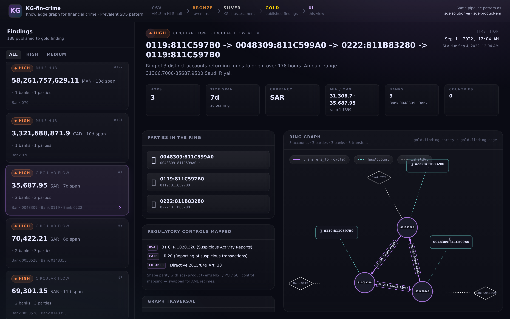

# KG-fin-crime

[](https://github.com/EigenAx2Pi/KG-fin-crime/actions/workflows/check.yml)
[](LICENSE)

**Graph-native AML detection on a 5M-transaction synthetic dataset.** A medallion pipeline (PostgreSQL bronze → silver → gold) that builds a FIBO-aligned knowledge graph over IBM's AMLSim "HI-Small" transactions, runs three independent typology detectors (two unsupervised graph traversals + one supervised label check), and exposes findings through a FastAPI + React/TypeScript dashboard.

> **Headline result.** The two graph-native detectors operate **without ever reading the ground-truth `is_laundering` label** (enforced in CI by `tests/test_invariants.py`). Measured post-hoc against the AMLSim ground truth:
>
> - **`circular_flow` precision: 57.7 %** (75 of 130 flagged transactions are labeled) vs **0.102 % base rate** → ~566× lift
> - **`circular_flow` ring-level overlap: 78.9 % strict / 83.5 % loose** — 86 of 109 detected 3-hop rings have *all three* hops flagged in the label, 91 of 109 touch at least one labeled edge
> - **`mule_hub`-flagged accounts** carry labeled transactions at ~68× the base rate
>
> Pure graph structure recovers what the labels know about — without knowing about them. Full numbers and SQL in [`docs/calibration.md`](docs/calibration.md); the methodology and caveats in [`docs/methodology.md`](docs/methodology.md).



## What this is meant to demonstrate

- **Medallion architecture without Spark.** Bronze (raw CSV mirror) → silver (FIBO-aligned KG, 4 node types and 5 typed edge tables) → gold (denormalized projection for the API). All in one Postgres 16 instance, separated by schema. Sized for explainability, not throughput.
- **A knowledge graph that lives in a relational database.** No Neo4j, no AGE. Just `silver.party`, `silver.account`, `silver.financial_institution`, `silver.financial_transaction`, and five typed edge tables (`silver.has_account`, `silver.is_held_at`, `silver.transfers_to`, …). Detectors are SQL with recursive CTEs and `LATERAL` joins.
- **Three detectors, three philosophies, same finding schema.** Every assessment writes to the same `silver.finding*` tables keyed by `assessment_id`. Gold publisher is typology-agnostic.
- **A discipline boundary that matters.** The unsupervised detectors do not read `bronze.is_laundering` — the label is used only post-hoc to score how well graph structure alone surfaces the same accounts the labels know about (~80% of detected rings touch labeled edges).
- **A control mapping per finding.** Each finding carries `control_bsa`, `control_fatf`, `control_eu_amld` — so a regulator-facing UI can show *which obligation* this detection covers.

## Quickstart

```bash
git clone <repo> kg-fin-crime
cd kg-fin-crime
cp .env.example .env

# 1. Get IBM AMLSim HI-Small CSVs (2 files, ~490 MB) and place them in ../data/
#    https://www.kaggle.com/datasets/ealtman2019/ibm-transactions-for-anti-money-laundering-aml
#    Needed: HI-Small_Trans.csv, HI-Small_accounts.csv

# 2. Boot Postgres and run the full pipeline
make demo

# 3. Open the dashboard
make ui
# → http://localhost:5173
```

`make demo` runs the cold-start sequence end-to-end: brings up Postgres, loads bronze, transforms to silver, runs all three assessments, publishes gold, and starts the API. First run takes ~22 minutes — most of it the one-time silver transform (per-row FK checks on 5M rows). Subsequent runs against an already-populated database start in seconds.

## Architecture

```
CSVs (AMLSim)                bronze.*                silver.*                            silver.finding*                       gold.*                          FastAPI       UI
                          raw-loaded mirror     FIBO-aligned KG                       assessments & findings                  display-ready projection
                                                (4 node types, 5 edges)               (3 typologies)
HI-Small_Trans     → transactions_raw → transfers_to / financial_transaction → circular_flow_v1     ─┐
HI-Small_accounts  → accounts_raw     → party / account / has_account        → mule_hub_v1           ├→ finding / finding_entity / finding_edge   →   /findings*  →  React dashboard
                                        + financial_institution / is_held_at → laundering_exposure_v1┘                                                /healthz       (Vite + Cytoscape)
```

Module map (all under `src/`):

| Module | Role |
|---|---|
| `bronze/load.py` | CSV → bronze via `COPY FROM STDIN`. Idempotent (TRUNCATE on rerun). |
| `silver/transform.py` | bronze → silver. Builds the 4 node tables + 5 edge tables. ~15 min cold (per-row FK checks; one-time cost). |
| `assessments/circular_flow.py` | 3-hop cycle detector. Graph-native, unsupervised. ~4 min (3-way self-join on 5M edges). |
| `assessments/mule_hub.py` | Fan-in/fan-out hub detector. Graph-native, unsupervised. ~30s. |
| `assessments/laundering_exposure.py` | Label-driven account scorer. Supervised — joins `silver.transfers_to` to `bronze.is_laundering=1`. ~2s. |
| `gold/publish.py` | silver → gold. Flattens summary_stats + control_mapping; denormalizes party/bank/country onto entity rows. <1s. Typology-agnostic. |
| `api/` | FastAPI — serves `gold.*` only. `GET /findings`, `/findings/{id}`, `/findings/{id}/graph`, `/healthz`. |
| `ui/` | Vite + React + TypeScript + Tailwind v4 + Cytoscape.js. Two screens: findings list, finding detail with ring graph. |

Full schema reference: [`docs/data-model.md`](docs/data-model.md). REST spec with TypeScript types and sample payloads: [`docs/api.md`](docs/api.md).

## The three detectors

The three were chosen to cover **structural, behavioral, and labeled** signal — three different gaps a real AML stack has to fill.

### 1. Circular flow — graph-native, unsupervised

3-hop cycles where money returns to the originating account in a short window. Pure graph traversal — three self-joins on `silver.transfers_to` with timestamp ordering. Surfaces 109 rings (32 HIGH / 77 MEDIUM). The hero ring (finding 81, HIGH) is a 3-hop loop NL → GB → AE → NL through 56k–51k SAR ACH transfers across 5 days in Sep 2022. **Does not read `bronze.is_laundering`.**

Post-hoc check: 87/109 rings (~80%) have *all three* hops flagged in the AMLSim ground truth, and 91/109 (~83%) touch at least one labeled edge. So the structure-only signal recovers the label-known cases without ever seeing the label.

### 2. Mule hub — graph-native, unsupervised

Accounts with extreme fan-in/fan-out asymmetry over a window — classic mule-account behavior. SQL `GROUP BY` over edges with thresholds tuned per severity. 40 findings (9 CRITICAL / 5 HIGH / 26 MEDIUM). Also label-blind.

### 3. Laundering exposure — supervised

The control case. Reads `bronze.is_laundering`, surfaces accounts where exposure exceeds a threshold. 39 findings (4 CRITICAL / 7 HIGH / 28 MEDIUM). Honest about what it is: if the label is wrong, this detector is wrong.

All three write the same shape — `silver.finding` + `silver.finding_entity` + `silver.finding_edge`, keyed by `assessment_id`. The gold publisher doesn't know which detector emitted which row.

## What's real, what's synthetic

| | Source |
|---|---|
| Transaction data | **IBM AMLSim HI-Small** — synthetic, ~5M txns, ~515k accounts, ground-truth `is_laundering` flag. |
| Account ↔ Bank ↔ Entity linkage | **AMLSim companion file** `HI-Small_accounts.csv` — bank name, bank id, account number, entity id, entity name. Loaded into `bronze.accounts_raw` and projected into `silver.party` / `silver.account` / `silver.has_account` / `silver.financial_institution`. |
| KYC detail (DOB, address, phone, email, gov_id, country, risk tier) | **Not populated.** `silver.party` retains the schema but those columns are NULL under this loader. UI risk-tier badges and country flags render blank. A future enrichment pass could synthesize or source them; today's pipeline leaves them empty rather than invent values. |
| Party / owner attribution on findings | **Synthesized 1:1.** The upstream Kaggle dataset was restructured in July 2025: `HI-Small_accounts.csv` and `HI-Small_Trans.csv` no longer share an account-key namespace, so transaction-side accounts have no real entity row. To keep the UI useful, `silver.party` emits a synthetic 1:1 party per transaction account, tagged `record_source = 'SYNTHESIZED (1:1 party-per-account)'`. Detector counts and ring topology are unchanged by this — it's UI-layer only. The real `accounts_raw`-sourced parties (518k of them) are loaded but happen to not overlap the transaction set under this dataset variant. |
| FIBO entity model | **Real** (subset). Party / Account / FinancialInstitution / FinancialTransaction with FIBO-aligned attribute names. |
| Control mapping (BSA / FATF / EU AMLD) | **Author-mapped to typologies.** A real deployment would source these from a regulator-maintained matrix. |
| Severity thresholds | Hand-picked to produce a demoable severity distribution. Not regulator-grade. |
| Detectors | Real SQL. The circular-flow detector in particular would generalize to a live `transfers_to` table. |

## Local dev

```bash
# Cold start — nothing running yet
make up          # docker compose up -d  (schema/*.sql applied on first boot)
make install     # python venv + pip install -e .
make pipeline    # bronze → silver → assessments → gold
make api         # uvicorn — http://127.0.0.1:8000  (docs at /docs)
make ui          # vite — http://localhost:5173

# Verify pipeline state
make check
# Expect: bronze.transactions_raw 5,078,345 / silver.party 166,207 / silver.finding 188 /
#         gold.finding 188 / gold.finding_entity 1,322 / gold.finding_edge 1,079

# Nuke and restart
make clean       # docker compose down -v
```

## Stack

- **Storage:** PostgreSQL 16 (single instance, schemas per medallion layer). Schema applied via `docker-entrypoint-initdb.d`.
- **Pipeline:** Python 3.10+, `psycopg[binary,pool]`, `pandas` (bronze only — `COPY FROM` after that), `python-dotenv`.
- **API:** FastAPI + Uvicorn. Serves `gold.*` exclusively — silver is internal.
- **UI:** Vite + React 18 + TypeScript + Tailwind v4 + Cytoscape.js (`cose-bilkent` layout). `/api` proxied to the FastAPI port.
- **No:** Spark, Iceberg, NiFi, Neo4j. Deliberate — the dataset fits in Postgres and the demo benefits from minimal moving parts.

## Roadmap

What this build does not have yet:
- **Tests.** Detectors are exercised manually via the validation queries in [`docs/build-log.md`](docs/build-log.md). A small `pytest` suite over canned silver fixtures is the obvious next step.
- **Auth.** API is open on `localhost`. Adding it is a real deployment concern, not a portfolio one.
- **A deployed demo.** Currently clone-and-run only. Fly.io + Vercel is the path.
- **More typologies.** Smurfing (sub-threshold structuring), pass-through accounts, dormant-then-active patterns. The finding schema already accommodates them.
- **Streaming.** Bronze is a CSV reload, not a CDC stream. The silver→gold pipeline could be driven incrementally by `transfers_to` triggers, but that's a different project.

## Background

This started as a Builders Club submission for the PAI Hackathon 2026 — the goal was to port the Prevalent SDS medallion pattern from cybersecurity exposure management to financial crime, demonstrating the platform is domain-agnostic. The hackathon scope is preserved as a process artifact in [`docs/build-log.md`](docs/build-log.md). The original upstream is <https://github.com/NIKHIL-523/KG-fin-crime>.
